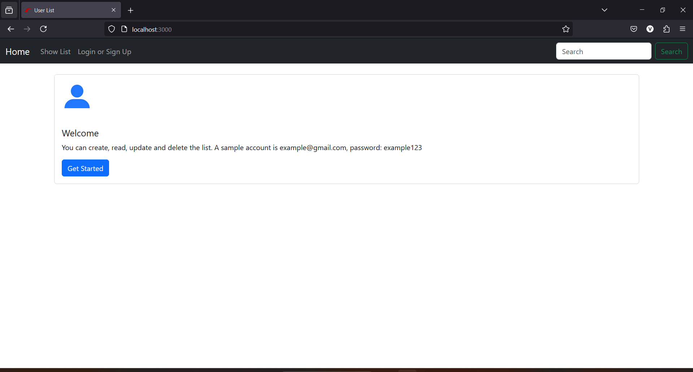

# User List Web Application Showcase

This tutorial will guide you through the features of the User List web application, including the homepage, user list with CRUD operations, and user authentication.

## Homepage

The homepage welcomes users and provides a starting point for using the application. It also includes an example account for testing.

- Example account: `example@gmail.com`, password: `example123`.

## User List and CRUD Operations

This section shows the list of users and the CRUD (Create, Read, Update, Delete) operations available.

- **Show List**: View the list of users.
- **Create**: Add new user information.
- **Update**: Edit existing user details.
- **Delete**: Remove users from the list.

## User Authentication

### Log In

Users can log in to access the application's features.

- **Email**: Enter your email address.
- **Password**: Enter your password.

### Sign Up

Users can sign up to create a new account.

- **Email**: Enter an email address.
- **Password**: Create a password (minimum 8 characters).
- **Confirm Password**: Confirm the password.

### Successful Sign In

After signing in successfully, users are redirected to the homepage with a notification.

- Notification: "You have successfully signed in."

## Adding New Information

Users can add new information such as name, description, last name, first name, email, and phone number.

- **First Name**: Enter the user's first name.
- **Last Name**: Enter the user's last name.
- **Email**: Provide the user's email address.
- **Phone Number**: Enter the user's phone number.
- **Description**: Provide a description.

## Viewing User Information

Users can view detailed information about a user by clicking the "Show" button.

- Details include User ID, First Name, Last Name, Phone Number, Email, and Description.

## Not Authorized to Edit Information

When a user tries to edit information that they are not authorized to edit, an error message is displayed.

- Error: "Not authorized to edit this information."

## Getting Started

To get started with the User List application:

1. Clone the repository to your local machine.
2. Install the necessary dependencies.
3. Run the application on your local server.

